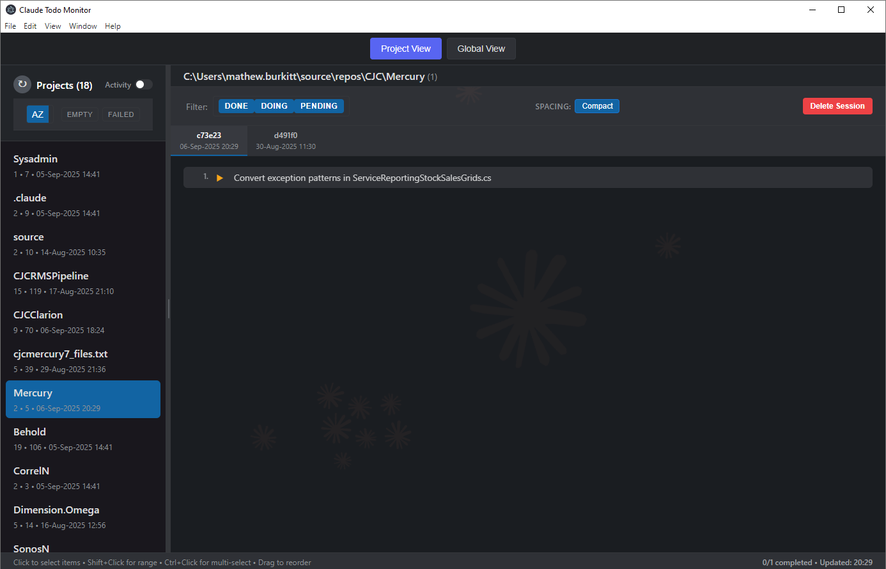
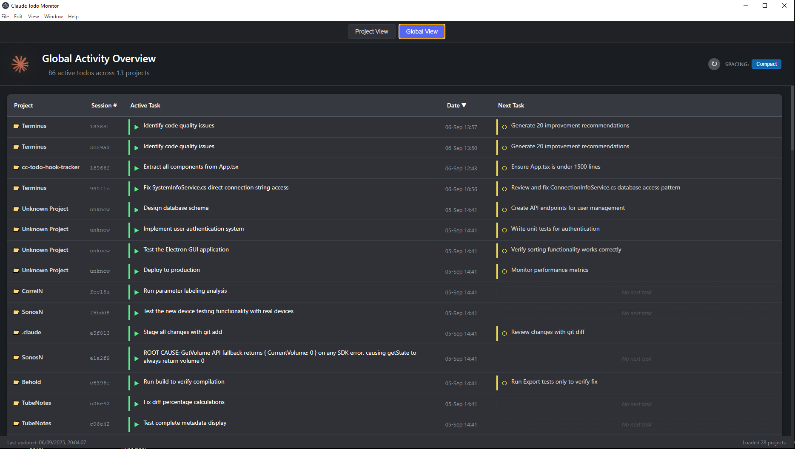

# Entropic - Multi-provider Session Monitor

[](https://github.com/dimension-zero/Entropic/stargazers)
[](https://github.com/dimension-zero/Entropic/network/members)
[](https://github.com/dimension-zero/Entropic/watchers)
[](https://github.com/dimension-zero/Entropic/issues)
[](https://github.com/dimension-zero/Entropic/pulls)
[](https://github.com/dimension-zero/Entropic/commits)
[](#license)
[](https://github.com/dimension-zero/Entropic)
[](https://github.com/dimension-zero/Entropic)

Entropic is a desktop companion for AI coding agents (Claude Code, OpenAI Codex, Google Gemini). The TypeScript/Electron app ingests the session and history folders created in `~/.claude`, `~/.codex`, and `~/.gemini`, merges them into a provider-aware data model, and renders a real-time dashboard with project activity, session diagnostics, prompt history, and maintenance tooling. The repository still ships the original PowerShell and Bash monitors for terminal-first workflows.




## Overview

- Multi-provider aggregator with debounced file watching, caching, and metadata repair
- Rich React UI with project and global dashboards, provider filters, spacing presets, and activity overlays
- Session utilities including multi-select merge previews, empty-session cleanup, and prompt history inspection
- Maintenance surface that runs diagnostics and metadata repair (dry-run or live) across Claude, Codex, and Gemini datasets
- Extensive Jest suite plus CLI monitors so you can pick the interface that fits your environment

## TypeScript / Electron application

### Highlights

- **Project view**: Auto-selects recent projects, restores last selection, filters todos by status, supports tab multi-select with merge previews, and provides delete/cleanup actions for session files.
- **Global view**: Summarises provider activity, shows unknown-session diagnostics, and exposes repair buttons that call `repairMetadataHex` with dry-run or live modes.
- **Unified title bar**: Toggles between project and global layouts, adjusts spacing density, runs manual refresh, and lets you enable/disable providers via a persistent allow-list.
- **Prompt history**: Loads JSONL transcripts through `getProjectPrompts`, supports chronological toggling, and offers context menus for quick actions.
- **Visual polish**: Animated background, boids simulation, and toast notifications (`__addToast`) keep long-running monitors informative without overwhelming the data.

### Architecture

- `src/main/main.ts` orchestrates Electron startup, single-instance locking, provider detection, and throttled file watching via `watchers/fileWatchers.ts`.
- Provider adapters in `src/main/adapters` (Claude, Codex, Gemini) transform on-disk todos and history into provider-neutral `Project` and `Session` models, expose diagnostics, and share repair helpers.
- The `Aggregator` (`src/main/core/aggregator.ts`) merges provider results, dedupes sessions, emits `data-changed`, and powers the `get-projects` IPC handler.
- IPC modules (`src/main/ipc/*.ts`) expose data (`get-projects`, `get-todos`), maintenance (`collect-diagnostics`, `repair-metadata`, `*-hex` variants), provider presence, and file management endpoints.
- `src/main/preload.ts` bridges those IPC endpoints into `window.electronAPI`, keeping the renderer sandboxed while still allowing data refresh, metadata repair, screenshot capture, and session deletion.
- The renderer relies on `src/services/DIContainer.ts` for a lightweight MVVM layer that wraps `electronAPI`, honours provider allow-lists, and feeds the React components in `src/App.*.tsx` and `src/components`.
- Shared utilities (`src/utils`) provide result combinators, path reconstruction (`PathUtils`), and todo helpers that are reused in both the main process and renderer and covered by Jest tests.

### Data sources and file watching

- Watches `~/.claude/projects`, `~/.claude/todos`, and `~/.claude/logs` by default; automatically adds Codex (`~/.codex/...`) and Gemini (`~/.gemini/sessions`) when present.
- Debounced watchers emit a provider-agnostic `data-changed` event so the renderer refreshes without entering high-frequency loops.
- `loaders/projects.ts` reconstructs real paths from flattened directory names, hydrates metadata, and writes `typescript/project.load.log` with each ingest cycle for troubleshooting.

### Maintenance and diagnostics

- Adapters expose `collectDiagnostics`/`repairMetadata`; the global view drives them through `collectDiagnosticsHex` and `repairMetadataHex` IPC calls.
- Repairs backfill `metadata.json` files to make future path reconstruction deterministic and report unknown sessions per provider.
- UI actions let you delete empty session files, purge obsolete tabs, and trigger screenshots (`take-screenshot`) for documentation or regression capture.

## Getting started (TypeScript/Electron)

### Requirements

- Node.js 20 or newer, npm 10+, and the Electron 36 runtime.
- Claude, Codex, or Gemini session directories under your home folder (the app will still run without them, but the dashboards will be empty).

### Install and run

```bash
cd typescript
npm install
npm run dev        # watch Electron main + Vite renderer with hot reload
```

After building, launch the production bundle with `npm start`.

### Build and package

```bash
npm run build      # compile main, preload, and renderer bundles
npm start          # run the compiled output inside Electron
npm run dist       # create platform-specific installers (AppImage, macOS dir, Windows portable)
```

`npm run dist:portable` emits a single-file Windows executable.

### Testing

```bash
npm test           # Jest unit/integration suite (aggregator, repositories, view models, UI)
npm test:watch
npm test:coverage
```

Browser-oriented tests use `jest-environment-jsdom`; helper mocks live in `src/tests/__mocks__`.

### Automation and debugging

- `npm run verify:screenshot` enables `ENTROPIC_AUTOSNAP=1` and grabs renderer snapshots via `scripts/launch-autosnap.mjs`.
- `typescript/project.load.log` captures every ingest attempt, including path reconstruction decisions and session counts.

## Repository layout

```
.
+-- README.md                  # This file
+-- TODO.md, Hexagon.md        # Planning and design notes
+-- typescript/                # Electron/React implementation
|   +-- src/
|   |   +-- main/              # Electron main process, adapters, IPC, watchers
|   |   +-- components/        # Renderer UI (title bar, panes, menus, boids, merge helpers)
|   |   +-- utils/             # Shared Result/Path/Todo helpers
|   |   +-- viewmodels/        # Legacy MVVM layer maintained for tests
|   |   +-- tests/             # Jest specs and integration harnesses
|   +-- assets/                # Logos and imagery used in the UI
|   +-- scripts/               # Build helpers, autosnap, update-to-latest
+-- powershell7/               # Cross-platform terminal monitor (PowerShell)
+-- bash/                      # Minimal Bash monitor
+-- GlobalView.png, ProjectView.png, Todo Tracker.png
```

## Other implementations

PowerShell and Bash monitors remain available for headless or remote workflows. See `README-ps.md` and `README-sh.md` for setup instructions and command examples.

## Codex provider metadata

To help the Codex adapter associate todos with real project paths, create sidecar files at `~/.codex/todos/{sessionId}-agent.meta.json` containing:

```json
{ "projectPath": "/absolute/path/to/project" }
```

Automation hooks in `HOOKS-codex.md` show how to emit these files from tool events.

## License

MIT License - feel free to modify and redistribute.

## Contributing

Issues and pull requests are welcome. Please run the Jest suite before submitting patches.

## Authors

- TypeScript/Electron application: Dimension Zero (@dimension-zero)
- PowerShell implementation: Dimension Zero (@dimension-zero)
- Original Bash hooks: Jameson Nyp (@JamesonNyp)
